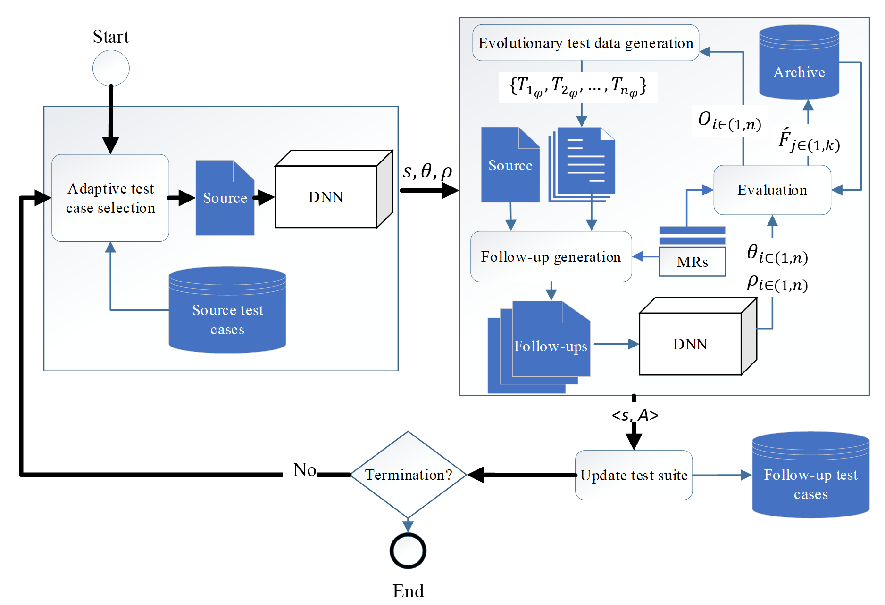
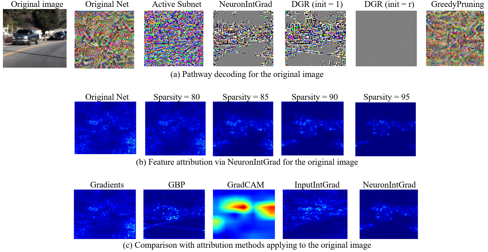
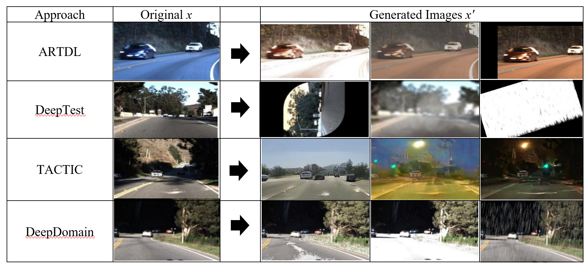

# DeepDomain

### Metamorphic Testing of Deep Neural Network-based Autonomous Driving Systems Using Behavioral Domain Adequacy

DeepDomain is a **gray-box, multi-objective test generation approach** for testing deep neural network (DNN)-based autonomous driving systems. It adaptively selects diverse source inputs and generates **domain-oriented follow-up tests** to expose model misbehaviours.

> **Core idea:** DeepDomain guides metamorphic test generation using **behavioral domain adequacy**, rather than relying solely on conventional neural coverage criteria.

<p align="center">
  
</p>

---

## Overview

Testing DNN-based autonomous driving systems is challenging because the correct output for an arbitrary input is often difficult to determine.

**Metamorphic Testing (MT)** addresses this oracle problem by generating follow-up inputs from source inputs according to predefined **metamorphic relations (MRs)**.

DeepDomain extends this idea by considering the **behavioral domains** explored during metamorphic test generation.

The approach combines:

* Metamorphic testing
* Search-based test generation
* Neuron contribution analysis
* Behavioral domain adequacy
* Multi-objective optimization
* Adaptive source-input selection
* Gray-box access to DNN internals

DeepDomain is designed particularly for **DNN predictor models with continuous outputs**, such as steering-angle prediction in autonomous driving, rather than classification models.

---

## 💡 Behavioral Domain Adequacy

DeepDomain considers two complementary dimensions of behavioral domain adequacy:

1. **Inter-behavioural domain**  
   Follow-up tests should explore behavioral regions that are **broader than those covered by their source tests**. This encourages the generation of tests that explore new behavioral regions rather than repeatedly producing similar behaviors.

2. **Intra-behavioural domain**  
   Once a misbehaviour-inducing region has been identified, follow-up tests should further explore its **neural boundary**. This allows DeepDomain to investigate regions around previously detected misbehaviours more systematically.

Together, these objectives guide the search from:

```text
New Behavioral Regions
          ↓
Misbehaviour-Inducing Regions
          ↓
Their Behavioral Boundaries
```

---

## 🎯 Key Contributions

* **Behavioral-domain-guided test generation**
  Uses behavioral-domain adequacy to guide test generation beyond conventional coverage criteria.

* **Critical neural pathway exploration**
  Uses neuron contribution analysis to identify and explore critical neural pathways.

* **Multi-objective search**
  Formulates test generation as a multi-objective optimization problem.

* **Adaptive source-input selection**
  Selects diverse source inputs to improve exploration of the input and behavioral spaces.

* **Gray-box metamorphic testing**
  Combines metamorphic testing with internal DNN information to guide test generation.

<p align="center">
  
</p>

---

## 🖼️ Generated Test Cases

DeepDomain generates follow-up inputs through metamorphic transformations while guiding the search toward behaviorally relevant regions.

The examples below illustrate generated test cases and their differences from source inputs and other test-generation approaches.

<p align="center">
  
</p>

---

## Experimental Evaluation

DeepDomain was evaluated on:

| Component                 | Setting                                    |
| ------------------------- | ------------------------------------------ |
| **DNN models**            | 3 autonomous-driving predictor models      |
| **Application**           | Udacity Self-Driving Car Challenge         |
| **Metamorphic Relations** | 18 MRs                                     |
| **Search strategy**       | DNSGA-II                                   |
| **Testing approach**      | Gray-box, search-based metamorphic testing |

---

## 📊 Results

The empirical evaluation shows that **behavioral domain adequacy can be a more effective indicator of test-generation effectiveness than conventional coverage criteria** for the evaluated DNN-based autonomous driving systems.

Compared with the evaluated baselines, DeepDomain achieved improvements of up to:

| Metric                                     |      Maximum improvement |
| ------------------------------------------ | -----------------------: |
| **Misbehaviour detection**                 |                  **94×** |
| **Fault-revealing capability**             |                  **79%** |
| **Output diversity**                       |                  **71%** |
| **Corner-case detection**                  |                 **187×** |
| **MR robustness subdomain identification** | **33 percentage points** |
| **Naturalness**                            |                   **2×** |

The results further indicate that:

* Conventional neural/structural coverage is not necessarily a reliable indicator of misbehaviour detection.
* **Black-box diversity-based** test generation can be less effective than the proposed gray-box approach.
* Behavioral-domain information can provide useful guidance for exploring failure-prone regions of DNN behavior.

> **Main finding:** Effective DNN testing requires not only exploring internal model structure, but also adequately exploring the model's **behavioral domain**.

---

## ⚙️ Installation

### System Requirements

The original experiments were developed and tested with:

* **OS:** Ubuntu 18.04
* **Python:** 3.8
* **RAM:** 8 GB or higher, depending on model size
* **GPU:** Recommended for TensorFlow/PyTorch-based models

> The repository reflects the environment used for the original experiments. Newer versions of Python and deep-learning frameworks may require compatibility adjustments.

### Setup

Clone the repository:

```bash
git clone https://github.com/<YOUR-USERNAME>/DeepDomain.git
cd DeepDomain
```

Create and activate a Python 3.8 environment, then install the dependencies:

```bash
pip install -r requirements.txt
```

---

## ▶️ Usage

### 1. Configure the project path

Open:

```text
constants.py
```

and set:

```python
SRC_DIR = "/path/to/project_root"
```

### 2. Configure the experiment

The main parameters are defined in:

```text
tools/DEEPDOMAIN/deep_domain.py
```

For example:

```python
gamma_list = [0.2, 0.3, 0.4]
search_algorithm = "DNSGAII"
mutant_generator_budget = 10 * 60
max_iteration = 6
start_epoch = 1
max_epoch = 6
n_variables = 2
m = 10
```

These parameters control the metamorphic transformation bounds, search strategy, generation budget, number of iterations/epochs, and source-test candidate pool.

### 3. Run DeepDomain

```bash
python tools/DEEPDOMAIN/deep_domain.py
```

---

## 📤 Output

Generated results are stored under:

```text
tools/DEEPDOMAIN/results/
```

A typical experiment produces:

```text
results/
└── dave2/
    └── DNSGAII/
        └── final_gama_0.2/
            └── epoch_1/
                ├── cache/
                ├── executed_images/
                ├── executed_images_features/
                ├── inconsistent_pool/
                ├── database.csv
                ├── executed_tests.npy
                ├── follow_ups_executed_info.csv
                └── source_executed_info.csv
```

### Main output files

| File / Directory               | Description                                                                                         |
| ------------------------------ | --------------------------------------------------------------------------------------------------- |
| `cache/`                       | Per-source test generation results, generated populations, follow-ups, metrics, and inconsistencies |
| `executed_images/`             | Images executed on the DNN model                                                                    |
| `executed_images_features/`    | Extracted features of generated test images                                                         |
| `inconsistent_pool/`           | Detected inconsistencies grouped by steering-angle categories                                       |
| `database.csv`                 | Test metadata, including MR index, parameter value, and consistency status                          |
| `executed_tests.npy`           | NumPy representation of executed tests                                                              |
| `follow_ups_executed_info.csv` | Follow-up execution information                                                                     |
| `source_executed_info.csv`     | Source execution information                                                                        |

---

## Repository Structure

```text
DeepDomain/
│
├── constants.py
├── configs/
├── dataset/
├── models/
├── pathway_grad/
│
├── tools/
│   └── DEEPDOMAIN/
│       ├── deep_domain.py
│       └── results/
│
├── docs/
│   └── images/
│       ├── deepdomain-workflow.png
│       ├── critical-neural-pathway.png
│       └── generated-test-cases.png
│
├── requirements.txt
├── README.md
└── LICENSE
```

---

## Paper

**Metamorphic Testing of Deep Neural Network-based Autonomous Driving Systems Using Behavioral Domain Adequacy**

**Akram Kalaee and Saeed Parsa**

The paper presents the DeepDomain approach, behavioral-domain adequacy criteria, test-generation methodology, and empirical evaluation.

---

## Dissertation

DeepDomain was developed as part of the Ph.D. research:

**Domain Analysis and Its Effect on Improving Testability and Explainability of Learning-based Cyber Physical Systems**

The dissertation contains additional technical details, formulations, figures, tables, and experimental analyses.

---

## Citation

If you use DeepDomain in your research, please cite:

```bibtex
@article{KalaeeDeepDomain,
  author  = {Kalaee, Akram and Parsa, Saeed},
  title   = {Metamorphic Testing of Deep Neural Network-based Autonomous Driving Systems Using Behavioral Domain Adequacy},
  journal = {Neural Computing and Applications},
  year    = {2025}
}
```

---

## License

This project is released under the license specified in [`LICENSE`](LICENSE).

---

## Authors

**Akram Kalaee**
Ph.D. in Software Engineering
Iran University of Science and Technology

**Saeed Parsa**
Iran University of Science and Technology

---

⭐ If you find this research useful, consider starring the repository.
